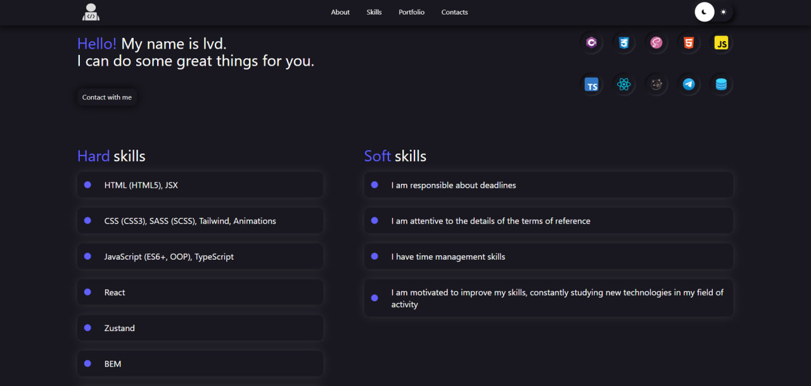

# lvd. - Portfolio

## 📸 Превью


## 🧠 Описание
Мое SPA портфолио на React + TypeScript с минималистичным UI/UX дизайном. Показывает навыки, проекты и контактную информацию. Есть возможность смены темы и просмотра изображения во весь экран

## 🛠 Технологии
- **Frontend**: React, TypeScript
- **UI**: Tailwind CSS
- **Состояние**: Zustand
- **Фреймворк**: Vite
- **Анимации**: Кастомные CSS-анимации

## 🚀 Как использовать
### Установка
```bash 
npm install
```
### Разработка
```bash 
npm  npm run dev
```
### Сборка
```bash 
npm  npm run build
```